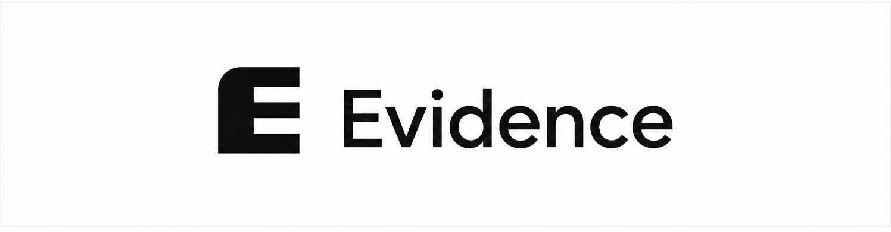

<p align="center"></p>

[](https://github.com/HigHollows/Evidence/actions/workflows/build.yml)

# Malware Analyzer

Outil Windows d'**investigation** de fichiers potentiellement malveillants — pas un
antivirus. Il collecte des preuves techniques depuis plusieurs sources (analyse
statique, VirusTotal, sandboxes cloud, YARA/Sigma, MITRE ATT&CK), les corrèle, puis
produit un rapport traçable jusqu'aux données brutes. Une IA optionnelle peut
expliquer le raisonnement, mais **le logiciel fonctionne intégralement sans elle**.

## Principe fondamental

Chaque affirmation est catégorisée : `OBSERVÉ`, `CORROBORÉ`, `PROBABLE`, `POSSIBLE`,
`NON OBSERVÉ`, `INCONNU`, `INCONCLUSIF`. Une capacité potentielle (une API trouvée
dans le binaire) n'est jamais confondue avec un comportement observé. L'absence de
preuve n'est jamais présentée comme une preuve d'absence. Aucun verdict n'est forcé :
un fichier peut être `INCONCLUSIF` si les preuves ne suffisent pas à conclure.

## État du projet

Développement par phases, voir [docs/ROADMAP.md](docs/ROADMAP.md).

- **Phase 1 (fait)** — application Windows, sélection de fichier (glisser-déposer ou
  dialogue), calcul de hash (SHA-256/SHA-1/MD5), détection de type par signature
  binaire (pas par extension), historique local SQLite.
- **Phase 2 (fait)** — analyse statique PE (EXE/DLL/SYS) : headers, sections et
  leur entropie, imports/exports, table d'imports "notables" catégorisée en
  **capacités potentielles** (jamais des preuves de comportement), chaînes
  ASCII/UTF-16 avec recherche, détection d'anomalies structurelles (empaquetage
  possible, sections exécutables+inscriptibles, etc.), présence et signataire
  Authenticode (sans validation de chaîne de confiance dans cette phase).
- **Phase 3 (en cours)** — provider VirusTotal : clé API personnelle stockée
  chiffrée (DPAPI) localement, jamais journalisée ni transmise à l'IA ; consultation
  par hash uniquement (pas d'upload du fichier) avec consentement explicite avant
  chaque requête ; mise en cache locale (24h) pour éviter les requêtes inutiles ;
  gestion des erreurs (clé invalide, quota atteint, service injoignable) sans
  bloquer le reste de l'analyse ; fenêtre **Outils > Fournisseurs** pour
  ajouter/tester/supprimer la clé. Architecture `IExternalProvider` posée pour
  brancher les futurs providers (sandbox, réputation, IA...) de la même façon.

Aucun autre provider externe (sandbox, IA) n'est encore branché : la fenêtre
l'indique explicitement (`INCONCLUSIF`) plutôt que d'afficher un faux résultat.

## Stack technique

- **.NET 8 / C# / WPF** — stabilité, intégration native Windows (Credential
  Manager/DPAPI pour les futurs secrets, associations de fichiers, menu contextuel),
  packaging `.exe` simple, écosystème mature pour l'analyse PE et le parsing binaire.
- **SQLite** (`Microsoft.Data.Sqlite`) pour l'historique local et le cache providers.
- **DPAPI** (`System.Security.Cryptography.ProtectedData`) pour chiffrer les clés API localement.
- **xUnit** pour les tests.

## Structure du dépôt

```text
src/
  MalwareAnalyzer.App/    Application WPF (UI)
  MalwareAnalyzer.Core/   Logique métier (hash, historique, modèles)
tests/
  MalwareAnalyzer.Tests/  Tests unitaires (xUnit)
docs/                     Documentation (roadmap, notes)
rules/ yara/ sigma/       Règles de détection (Phase 6)
locales/                  Chaînes UI externalisées (fr/en, section 48)
assets/                   Ressources graphiques
scripts/                  Scripts de build/dev
installer/                Installateur Windows (phase ultérieure)
```

## Compilation

Nécessite le **SDK .NET 8** (pas seulement le runtime) : https://dotnet.microsoft.com/download/dotnet/8.0

```bash
dotnet build src/MalwareAnalyzer.sln
dotnet test src/MalwareAnalyzer.sln
dotnet run --project src/MalwareAnalyzer.App
```

## Clés API et confidentialité

Aucune clé API n'est fournie avec l'application. Chaque utilisateur configure ses
propres clés (VirusTotal, sandbox, IA) dans les paramètres, à partir de la Phase 3.
Les secrets ne sont jamais écrits dans les logs, les rapports, ni envoyés à l'IA.
Rien n'est envoyé vers un service externe sans confirmation explicite.

## Coût

Objectif 0 € : uniquement des services avec offre gratuite, sous clés personnelles de
l'utilisateur. Aucune infrastructure serveur ni abonnement n'est requis pour utiliser
le logiciel.

## Licence

[MIT](LICENSE).
